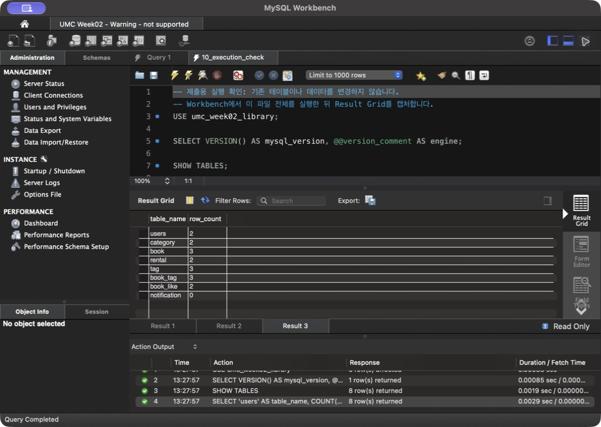
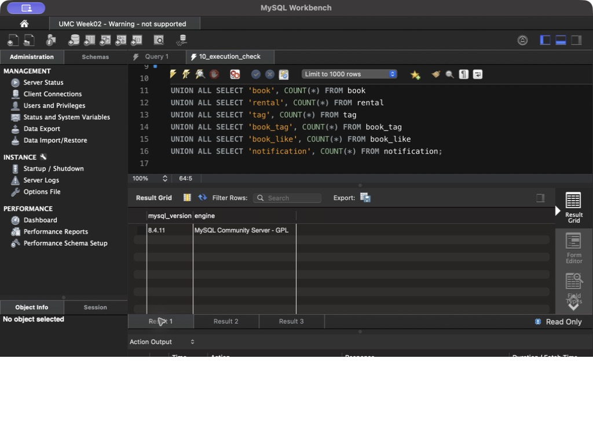
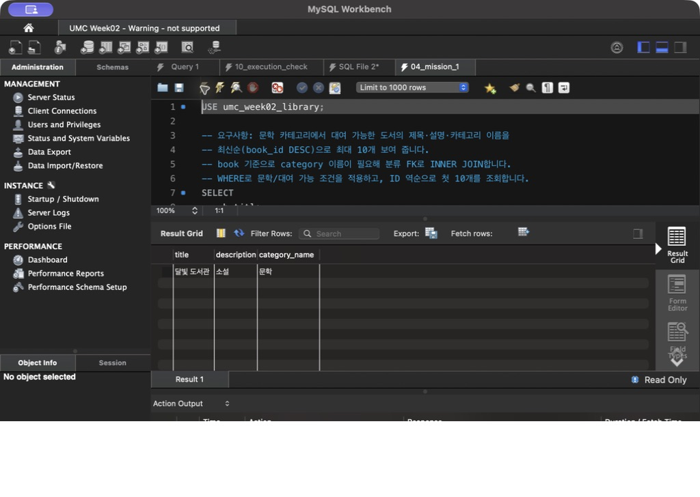
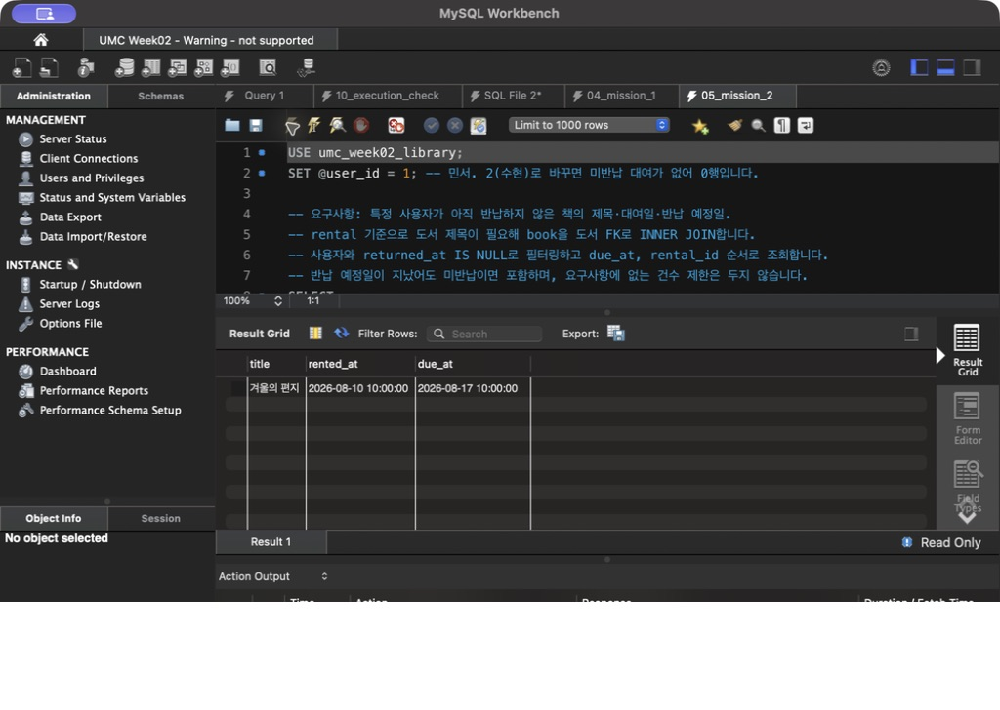
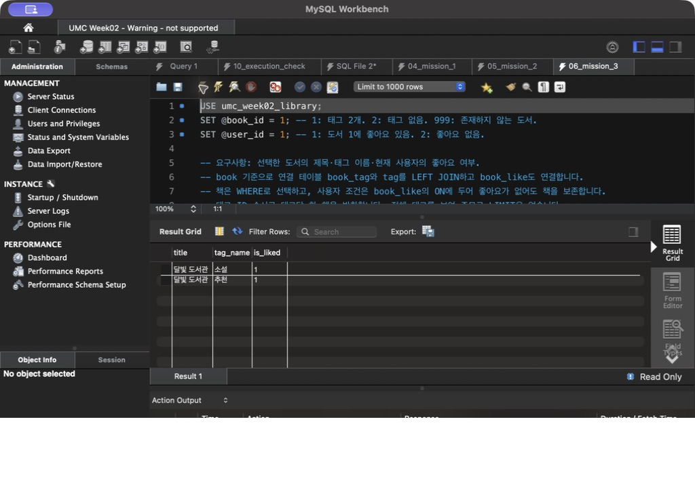
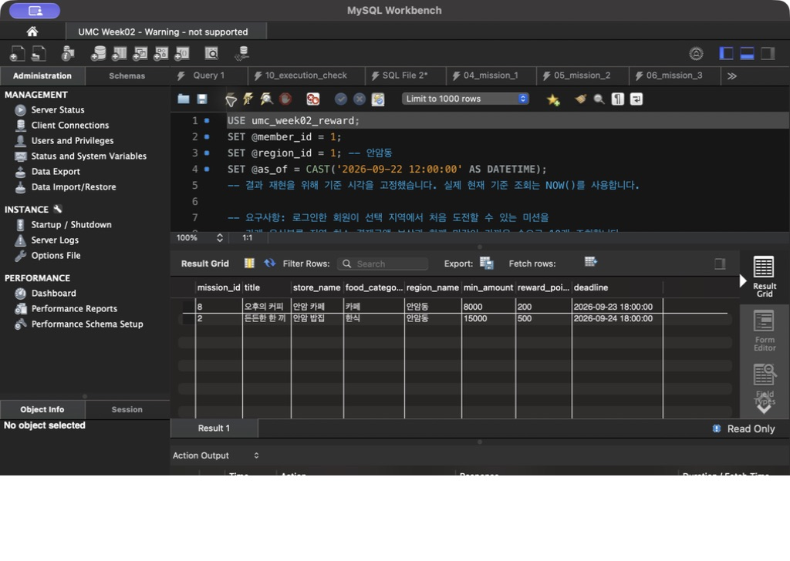

# 실제 MySQL Workbench 실행 화면

2026-09-22, Workbench 8.0.47에서 로컬 MySQL Community Server 8.4.11에 연결하여 실행한 화면입니다. 원본 스크린샷이며, 값이나 결과 표를 편집하지 않았습니다. 전체 SQL과 텍스트 결과는 상위 폴더의 파일을 참고하세요.

## 테이블과 공통 데이터 행 수

## MySQL 버전

## 미션 1

문학 분류이면서 대여 가능한 `달빛 도서관` 1행이 반환되었습니다.

## 미션 2

민서의 미반납 도서 `겨울의 편지`와 대여일·반납 예정일이 반환되었습니다.

## 미션 3

`달빛 도서관`의 태그 `소설`, `추천`과 민서의 좋아요 여부 `1`이 반환되었습니다.

## 1주차 리워드 ERD 확장

안암동에서 새로 도전 가능한 미션 `8`, `2`가 마감이 가까운 순서로 반환되었습니다.

